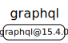
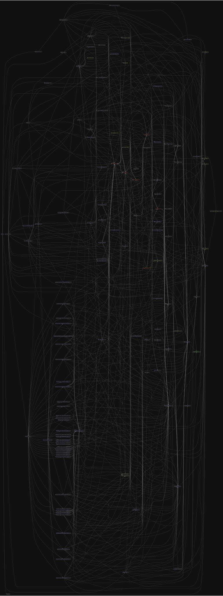

# 源码分析

## 文件结构

``` bash
/Users/liufang/openSource/FunnyLiu/graphql-js
├── integrationTests
|  ├── README.md
|  ├── flow
|  |  ├── index.mjs
|  |  └── package.json
|  ├── integration-test.js
|  ├── node
|  |  ├── index.js
|  |  ├── package.json
|  |  └── test.js
|  └── ts
|     ├── index.ts
|     ├── package.json
|     ├── test.js
|     └── tsconfig.json
├── resources
|  ├── add-extension-to-import-paths.js
|  ├── build-deno.js
|  ├── build-npm.js
|  ├── check-cycles.js
|  ├── checkgit.sh
|  ├── eslint-internal-rules
|  |  ├── README.md
|  |  ├── index.js
|  |  ├── no-dir-import.js
|  |  └── package.json
|  ├── gen-changelog.js
|  ├── gen-version.js
|  ├── gitpublish.sh
|  ├── inline-invariant.js
|  └── utils.js
├── src
|  ├── README.md
|  ├── __testUtils__
|  |  ├── __tests__
|  |  |  ├── dedent-test.js
|  |  |  ├── genFuzzStrings-test.js
|  |  |  ├── inspectStr-test.js
|  |  |  └── resolveOnNextTick-test.js
|  |  ├── dedent.js
|  |  ├── genFuzzStrings.js
|  |  ├── inspectStr.js
|  |  ├── kitchenSinkQuery.js
|  |  ├── kitchenSinkSDL.js
|  |  └── resolveOnNextTick.js
|  ├── __tests__
|  |  ├── starWarsData.js
|  |  ├── starWarsIntrospection-test.js
|  |  ├── starWarsQuery-test.js
|  |  ├── starWarsSchema.js
|  |  ├── starWarsValidation-test.js
|  |  └── version-test.js
|  ├── error
|  |  ├── GraphQLError.d.ts
|  |  ├── GraphQLError.js
|  |  ├── README.md
|  |  ├── __tests__
|  |  |  ├── GraphQLError-test.js
|  |  |  ├── formatError-test.js
|  |  |  └── locatedError-test.js
|  |  ├── formatError.d.ts
|  |  ├── formatError.js
|  |  ├── index.d.ts
|  |  ├── index.js
|  |  ├── locatedError.d.ts
|  |  ├── locatedError.js
|  |  ├── syntaxError.d.ts
|  |  └── syntaxError.js
|  ├── execution
|  |  ├── README.md
|  |  ├── __tests__
|  |  |  ├── abstract-test.js
|  |  |  ├── directives-test.js
|  |  |  ├── executor-test.js
|  |  |  ├── lists-test.js
|  |  |  ├── mutations-test.js
|  |  |  ├── nonnull-test.js
|  |  |  ├── resolve-test.js
|  |  |  ├── schema-test.js
|  |  |  ├── sync-test.js
|  |  |  ├── union-interface-test.js
|  |  |  └── variables-test.js
|  |  ├── execute.d.ts
|  |  ├── execute.js
|  |  ├── index.d.ts
|  |  ├── index.js
|  |  ├── values.d.ts
|  |  └── values.js
|  ├── graphql.d.ts
|  ├── graphql.js
|  ├── index.d.ts
|  ├── index.js
|  ├── jsutils
|  |  ├── Maybe.d.ts
|  |  ├── ObjMap.js
|  |  ├── Path.d.ts
|  |  ├── Path.js
|  |  ├── PromiseOrValue.d.ts
|  |  ├── PromiseOrValue.js
|  |  ├── README.md
|  |  ├── __tests__
|  |  |  ├── didYouMean-test.js
|  |  |  ├── identityFunc-test.js
|  |  |  ├── inspect-test.js
|  |  |  ├── instanceOf-test.js
|  |  |  ├── invariant-test.js
|  |  |  ├── isAsyncIterable-test.js
|  |  |  ├── isCollection-test.js
|  |  |  ├── isObjectLike-test.js
|  |  |  ├── suggestionList-test.js
|  |  |  └── toObjMap-test.js
|  |  ├── defineInspect.js
|  |  ├── devAssert.js
|  |  ├── didYouMean.js
|  |  ├── identityFunc.js
|  |  ├── inspect.js
|  |  ├── instanceOf.js
|  |  ├── invariant.js
|  |  ├── isAsyncIterable.js
|  |  ├── isCollection.js
|  |  ├── isObjectLike.js
|  |  ├── isPromise.js
|  |  ├── keyMap.js
|  |  ├── keyValMap.js
|  |  ├── mapValue.js
|  |  ├── memoize3.js
|  |  ├── nodejsCustomInspectSymbol.js
|  |  ├── printPathArray.js
|  |  ├── promiseForObject.js
|  |  ├── promiseReduce.js
|  |  ├── suggestionList.js
|  |  └── toObjMap.js
|  ├── language
|  |  ├── README.md
|  |  ├── __tests__
|  |  |  ├── blockString-fuzz.js
|  |  |  ├── blockString-test.js
|  |  |  ├── lexer-test.js
|  |  |  ├── parser-test.js
|  |  |  ├── predicates-test.js
|  |  |  ├── printLocation-test.js
|  |  |  ├── printer-test.js
|  |  |  ├── schema-parser-test.js
|  |  |  ├── schema-printer-test.js
|  |  |  ├── source-test.js
|  |  |  ├── toJSONDeep.js
|  |  |  └── visitor-test.js
|  |  ├── ast.d.ts
|  |  ├── ast.js
|  |  ├── blockString.d.ts
|  |  ├── blockString.js
|  |  ├── directiveLocation.d.ts
|  |  ├── directiveLocation.js
|  |  ├── experimentalOnlineParser
|  |  |  ├── README.md
|  |  |  ├── grammar.d.ts
|  |  |  ├── grammar.js
|  |  |  ├── index.d.ts
|  |  |  ├── index.js
|  |  |  ├── onlineParser.d.ts
|  |  |  └── onlineParser.js
|  |  ├── index.d.ts
|  |  ├── index.js
|  |  ├── kinds.d.ts
|  |  ├── kinds.js
|  |  ├── lexer.d.ts
|  |  ├── lexer.js
|  |  ├── location.d.ts
|  |  ├── location.js
|  |  ├── parser.d.ts
|  |  ├── parser.js - gql解析语法的逻辑所在
|  |  ├── predicates.d.ts
|  |  ├── predicates.js
|  |  ├── printLocation.d.ts
|  |  ├── printLocation.js
|  |  ├── printer.d.ts
|  |  ├── printer.js
|  |  ├── source.d.ts
|  |  ├── source.js
|  |  ├── tokenKind.d.ts
|  |  ├── tokenKind.js
|  |  ├── visitor.d.ts
|  |  └── visitor.js
|  ├── polyfills
|  |  ├── README.md
|  |  ├── arrayFrom.js
|  |  ├── find.js
|  |  ├── isFinite.js
|  |  ├── isInteger.js
|  |  ├── objectEntries.js
|  |  ├── objectValues.js
|  |  └── symbols.js
|  ├── subscription
|  |  ├── README.md
|  |  ├── __tests__
|  |  |  ├── mapAsyncIterator-test.js
|  |  |  ├── simplePubSub-test.js
|  |  |  ├── simplePubSub.js
|  |  |  └── subscribe-test.js
|  |  ├── index.d.ts
|  |  ├── index.js
|  |  ├── mapAsyncIterator.d.ts
|  |  ├── mapAsyncIterator.js
|  |  ├── subscribe.d.ts
|  |  └── subscribe.js
|  ├── type
|  |  ├── README.md
|  |  ├── __tests__
|  |  |  ├── definition-test.js
|  |  |  ├── directive-test.js
|  |  |  ├── enumType-test.js
|  |  |  ├── extensions-test.js
|  |  |  ├── introspection-test.js
|  |  |  ├── predicate-test.js
|  |  |  ├── scalars-test.js
|  |  |  ├── schema-test.js
|  |  |  └── validation-test.js
|  |  ├── definition.d.ts
|  |  ├── definition.js
|  |  ├── directives.d.ts
|  |  ├── directives.js
|  |  ├── index.d.ts
|  |  ├── index.js
|  |  ├── introspection.d.ts
|  |  ├── introspection.js
|  |  ├── scalars.d.ts
|  |  ├── scalars.js
|  |  ├── schema.d.ts
|  |  ├── schema.js
|  |  ├── validate.d.ts
|  |  └── validate.js
|  ├── utilities
|  |  ├── README.md
|  |  ├── TypeInfo.d.ts
|  |  ├── TypeInfo.js
|  |  ├── __tests__
|  |  |  ├── TypeInfo-test.js
|  |  |  ├── assertValidName-test.js
|  |  |  ├── astFromValue-test.js
|  |  |  ├── buildASTSchema-test.js
|  |  |  ├── buildClientSchema-test.js
|  |  |  ├── coerceInputValue-test.js
|  |  |  ├── concatAST-test.js
|  |  |  ├── extendSchema-test.js
|  |  |  ├── findBreakingChanges-test.js
|  |  |  ├── getIntrospectionQuery-test.js
|  |  |  ├── getOperationAST-test.js
|  |  |  ├── getOperationRootType-test.js
|  |  |  ├── introspectionFromSchema-test.js
|  |  |  ├── lexicographicSortSchema-test.js
|  |  |  ├── printSchema-test.js
|  |  |  ├── separateOperations-test.js
|  |  |  ├── stripIgnoredCharacters-fuzz.js
|  |  |  ├── stripIgnoredCharacters-test.js
|  |  |  ├── typeComparators-test.js
|  |  |  ├── valueFromAST-test.js
|  |  |  └── valueFromASTUntyped-test.js
|  |  ├── assertValidName.d.ts
|  |  ├── assertValidName.js
|  |  ├── astFromValue.d.ts
|  |  ├── astFromValue.js
|  |  ├── buildASTSchema.d.ts
|  |  ├── buildASTSchema.js
|  |  ├── buildClientSchema.d.ts
|  |  ├── buildClientSchema.js
|  |  ├── coerceInputValue.d.ts
|  |  ├── coerceInputValue.js
|  |  ├── concatAST.d.ts
|  |  ├── concatAST.js
|  |  ├── extendSchema.d.ts
|  |  ├── extendSchema.js
|  |  ├── findBreakingChanges.d.ts
|  |  ├── findBreakingChanges.js
|  |  ├── findDeprecatedUsages.d.ts
|  |  ├── findDeprecatedUsages.js
|  |  ├── getIntrospectionQuery.d.ts
|  |  ├── getIntrospectionQuery.js
|  |  ├── getOperationAST.d.ts
|  |  ├── getOperationAST.js
|  |  ├── getOperationRootType.d.ts
|  |  ├── getOperationRootType.js
|  |  ├── index.d.ts
|  |  ├── index.js
|  |  ├── introspectionFromSchema.d.ts
|  |  ├── introspectionFromSchema.js
|  |  ├── lexicographicSortSchema.d.ts
|  |  ├── lexicographicSortSchema.js
|  |  ├── printSchema.d.ts
|  |  ├── printSchema.js
|  |  ├── separateOperations.d.ts
|  |  ├── separateOperations.js
|  |  ├── stripIgnoredCharacters.d.ts
|  |  ├── stripIgnoredCharacters.js
|  |  ├── typeComparators.d.ts
|  |  ├── typeComparators.js
|  |  ├── typeFromAST.d.ts
|  |  ├── typeFromAST.js
|  |  ├── typedQueryDocumentNode.d.ts
|  |  ├── valueFromAST.d.ts
|  |  ├── valueFromAST.js
|  |  ├── valueFromASTUntyped.d.ts
|  |  └── valueFromASTUntyped.js
|  ├── validation
|  |  ├── README.md
|  |  ├── ValidationContext.d.ts
|  |  ├── ValidationContext.js
|  |  ├── __tests__
|  |  |  ├── ExecutableDefinitionsRule-test.js
|  |  |  ├── FieldsOnCorrectTypeRule-test.js
|  |  |  ├── FragmentsOnCompositeTypesRule-test.js
|  |  |  ├── KnownArgumentNamesRule-test.js
|  |  |  ├── KnownDirectivesRule-test.js
|  |  |  ├── KnownFragmentNamesRule-test.js
|  |  |  ├── KnownTypeNamesRule-test.js
|  |  |  ├── LoneAnonymousOperationRule-test.js
|  |  |  ├── LoneSchemaDefinitionRule-test.js
|  |  |  ├── NoDeprecatedCustomRule-test.js
|  |  |  ├── NoFragmentCyclesRule-test.js
|  |  |  ├── NoSchemaIntrospectionCustomRule-test.js
|  |  |  ├── NoUndefinedVariablesRule-test.js
|  |  |  ├── NoUnusedFragmentsRule-test.js
|  |  |  ├── NoUnusedVariablesRule-test.js
|  |  |  ├── OverlappingFieldsCanBeMergedRule-test.js
|  |  |  ├── PossibleFragmentSpreadsRule-test.js
|  |  |  ├── PossibleTypeExtensionsRule-test.js
|  |  |  ├── ProvidedRequiredArgumentsRule-test.js
|  |  |  ├── ScalarLeafsRule-test.js
|  |  |  ├── SingleFieldSubscriptionsRule-test.js
|  |  |  ├── UniqueArgumentNamesRule-test.js
|  |  |  ├── UniqueDirectiveNamesRule-test.js
|  |  |  ├── UniqueDirectivesPerLocationRule-test.js
|  |  |  ├── UniqueEnumValueNamesRule-test.js
|  |  |  ├── UniqueFieldDefinitionNamesRule-test.js
|  |  |  ├── UniqueFragmentNamesRule-test.js
|  |  |  ├── UniqueInputFieldNamesRule-test.js
|  |  |  ├── UniqueOperationNamesRule-test.js
|  |  |  ├── UniqueOperationTypesRule-test.js
|  |  |  ├── UniqueTypeNamesRule-test.js
|  |  |  ├── UniqueVariableNamesRule-test.js
|  |  |  ├── ValuesOfCorrectTypeRule-test.js
|  |  |  ├── VariablesAreInputTypesRule-test.js
|  |  |  ├── VariablesInAllowedPositionRule-test.js
|  |  |  ├── harness.js
|  |  |  └── validation-test.js
|  |  ├── index.d.ts
|  |  ├── index.js
|  |  ├── rules
|  |  |  ├── ExecutableDefinitions.d.ts
|  |  |  ├── ExecutableDefinitions.js
|  |  |  ├── ExecutableDefinitionsRule.d.ts
|  |  |  ├── ExecutableDefinitionsRule.js
|  |  |  ├── FieldsOnCorrectTypeRule.d.ts
|  |  |  ├── FieldsOnCorrectTypeRule.js
|  |  |  ├── FragmentsOnCompositeTypesRule.d.ts
|  |  |  ├── FragmentsOnCompositeTypesRule.js
|  |  |  ├── KnownArgumentNamesRule.d.ts
|  |  |  ├── KnownArgumentNamesRule.js
|  |  |  ├── KnownDirectivesRule.d.ts
|  |  |  ├── KnownDirectivesRule.js
|  |  |  ├── KnownFragmentNamesRule.d.ts
|  |  |  ├── KnownFragmentNamesRule.js
|  |  |  ├── KnownTypeNamesRule.d.ts
|  |  |  ├── KnownTypeNamesRule.js
|  |  |  ├── LoneAnonymousOperationRule.d.ts
|  |  |  ├── LoneAnonymousOperationRule.js
|  |  |  ├── LoneSchemaDefinition.d.ts
|  |  |  ├── LoneSchemaDefinition.js
|  |  |  ├── LoneSchemaDefinitionRule.d.ts
|  |  |  ├── LoneSchemaDefinitionRule.js
|  |  |  ├── NoFragmentCyclesRule.d.ts
|  |  |  ├── NoFragmentCyclesRule.js
|  |  |  ├── NoUndefinedVariablesRule.d.ts
|  |  |  ├── NoUndefinedVariablesRule.js
|  |  |  ├── NoUnusedFragmentsRule.d.ts
|  |  |  ├── NoUnusedFragmentsRule.js
|  |  |  ├── NoUnusedVariablesRule.d.ts
|  |  |  ├── NoUnusedVariablesRule.js
|  |  |  ├── OverlappingFieldsCanBeMergedRule.d.ts
|  |  |  ├── OverlappingFieldsCanBeMergedRule.js
|  |  |  ├── PossibleFragmentSpreadsRule.d.ts
|  |  |  ├── PossibleFragmentSpreadsRule.js
|  |  |  ├── PossibleTypeExtensions.d.ts
|  |  |  ├── PossibleTypeExtensions.js
|  |  |  ├── PossibleTypeExtensionsRule.d.ts
|  |  |  ├── PossibleTypeExtensionsRule.js
|  |  |  ├── ProvidedRequiredArgumentsRule.d.ts
|  |  |  ├── ProvidedRequiredArgumentsRule.js
|  |  |  ├── ScalarLeafsRule.d.ts
|  |  |  ├── ScalarLeafsRule.js
|  |  |  ├── SingleFieldSubscriptionsRule.d.ts
|  |  |  ├── SingleFieldSubscriptionsRule.js
|  |  |  ├── UniqueArgumentNamesRule.d.ts
|  |  |  ├── UniqueArgumentNamesRule.js
|  |  |  ├── UniqueDirectiveNames.d.ts
|  |  |  ├── UniqueDirectiveNames.js
|  |  |  ├── UniqueDirectiveNamesRule.d.ts
|  |  |  ├── UniqueDirectiveNamesRule.js
|  |  |  ├── UniqueDirectivesPerLocationRule.d.ts
|  |  |  ├── UniqueDirectivesPerLocationRule.js
|  |  |  ├── UniqueEnumValueNames.d.ts
|  |  |  ├── UniqueEnumValueNames.js
|  |  |  ├── UniqueEnumValueNamesRule.d.ts
|  |  |  ├── UniqueEnumValueNamesRule.js
|  |  |  ├── UniqueFieldDefinitionNames.d.ts
|  |  |  ├── UniqueFieldDefinitionNames.js
|  |  |  ├── UniqueFieldDefinitionNamesRule.d.ts
|  |  |  ├── UniqueFieldDefinitionNamesRule.js
|  |  |  ├── UniqueFragmentNamesRule.d.ts
|  |  |  ├── UniqueFragmentNamesRule.js
|  |  |  ├── UniqueInputFieldNamesRule.d.ts
|  |  |  ├── UniqueInputFieldNamesRule.js
|  |  |  ├── UniqueOperationNamesRule.d.ts
|  |  |  ├── UniqueOperationNamesRule.js
|  |  |  ├── UniqueOperationTypes.d.ts
|  |  |  ├── UniqueOperationTypes.js
|  |  |  ├── UniqueOperationTypesRule.d.ts
|  |  |  ├── UniqueOperationTypesRule.js
|  |  |  ├── UniqueTypeNames.d.ts
|  |  |  ├── UniqueTypeNames.js
|  |  |  ├── UniqueTypeNamesRule.d.ts
|  |  |  ├── UniqueTypeNamesRule.js
|  |  |  ├── UniqueVariableNamesRule.d.ts
|  |  |  ├── UniqueVariableNamesRule.js
|  |  |  ├── ValuesOfCorrectTypeRule.d.ts
|  |  |  ├── ValuesOfCorrectTypeRule.js
|  |  |  ├── VariablesAreInputTypesRule.d.ts
|  |  |  ├── VariablesAreInputTypesRule.js
|  |  |  ├── VariablesInAllowedPositionRule.d.ts
|  |  |  ├── VariablesInAllowedPositionRule.js
|  |  |  └── custom
|  |  |     ├── NoDeprecatedCustomRule.d.ts
|  |  |     ├── NoDeprecatedCustomRule.js
|  |  |     ├── NoSchemaIntrospectionCustomRule.d.ts
|  |  |     └── NoSchemaIntrospectionCustomRule.js
|  |  ├── specifiedRules.d.ts
|  |  ├── specifiedRules.js
|  |  ├── validate.d.ts
|  |  └── validate.js
|  ├── version.d.ts
|  └── version.js

ignored

```

## 外部模块依赖



## 内部模块依赖


  


# GraphQL.js

The JavaScript reference implementation for GraphQL, a query language for APIs created by Facebook.

[](https://badge.fury.io/js/graphql)
[](https://github.com/graphql/graphql-js/actions?query=branch%3Amaster)
[](https://codecov.io/gh/graphql/graphql-js)

See more complete documentation at https://graphql.org/ and
https://graphql.org/graphql-js/.

Looking for help? Find resources [from the community](https://graphql.org/community/).

## Getting Started

A general overview of GraphQL is available in the
[README](https://github.com/graphql/graphql-spec/blob/master/README.md) for the
[Specification for GraphQL](https://github.com/graphql/graphql-spec). That overview
describes a simple set of GraphQL examples that exist as [tests](src/__tests__)
in this repository. A good way to get started with this repository is to walk
through that README and the corresponding tests in parallel.

### Using GraphQL.js

Install GraphQL.js from npm

With npm:

```sh
npm install --save graphql
```

or using yarn:

```sh
yarn add graphql
```

GraphQL.js provides two important capabilities: building a type schema and
serving queries against that type schema.

First, build a GraphQL type schema which maps to your codebase.

```js
import {
  graphql,
  GraphQLSchema,
  GraphQLObjectType,
  GraphQLString,
} from 'graphql';

var schema = new GraphQLSchema({
  query: new GraphQLObjectType({
    name: 'RootQueryType',
    fields: {
      hello: {
        type: GraphQLString,
        resolve() {
          return 'world';
        },
      },
    },
  }),
});
```

This defines a simple schema, with one type and one field, that resolves
to a fixed value. The `resolve` function can return a value, a promise,
or an array of promises. A more complex example is included in the top-level [tests](src/__tests__) directory.

Then, serve the result of a query against that type schema.

```js
var query = '{ hello }';

graphql(schema, query).then((result) => {
  // Prints
  // {
  //   data: { hello: "world" }
  // }
  console.log(result);
});
```

This runs a query fetching the one field defined. The `graphql` function will
first ensure the query is syntactically and semantically valid before executing
it, reporting errors otherwise.

```js
var query = '{ BoyHowdy }';

graphql(schema, query).then((result) => {
  // Prints
  // {
  //   errors: [
  //     { message: 'Cannot query field BoyHowdy on RootQueryType',
  //       locations: [ { line: 1, column: 3 } ] }
  //   ]
  // }
  console.log(result);
});
```

**Note**: Please don't forget to set `NODE_ENV=production` if you are running a production server. It will disable some checks that can be useful during development but will significantly improve performance.

### Want to ride the bleeding edge?

The `npm` branch in this repository is automatically maintained to be the last
commit to `master` to pass all tests, in the same form found on npm. It is
recommended to use builds deployed to npm for many reasons, but if you want to use
the latest not-yet-released version of graphql-js, you can do so by depending
directly on this branch:

```
npm install graphql@git://github.com/graphql/graphql-js.git#npm
```

### Experimental features

Each release of GraphQL.js will be accompanied by an experimental release containing support for the `@defer` and `@stream` directive proposal. We are hoping to get community feedback on these releases before the proposal is accepted into the GraphQL specification. You can use this experimental release of GraphQL.js by adding the following to your project's `package.json` file.

```
"graphql": "experimental-stream-defer"
```

Community feedback on this experimental release is much appreciated and can be provided on the [issue created for this purpose](https://github.com/graphql/graphql-js/issues/2848).

### Using in a Browser

GraphQL.js is a general-purpose library and can be used both in a Node server
and in the browser. As an example, the [GraphiQL](https://github.com/graphql/graphiql/)
tool is built with GraphQL.js!

Building a project using GraphQL.js with [webpack](https://webpack.js.org) or
[rollup](https://github.com/rollup/rollup) should just work and only include
the portions of the library you use. This works because GraphQL.js is distributed
with both CommonJS (`require()`) and ESModule (`import`) files. Ensure that any
custom build configurations look for `.mjs` files!

### Contributing

We actively welcome pull requests. Learn how to [contribute](./.github/CONTRIBUTING.md).

### Changelog

Changes are tracked as [GitHub releases](https://github.com/graphql/graphql-js/releases).

### License

GraphQL.js is [MIT-licensed](./LICENSE).

### Credits

The `*.d.ts` files in this project are based on [DefinitelyTyped](https://github.com/DefinitelyTyped/DefinitelyTyped/tree/54712a7e28090c5b1253b746d1878003c954f3ff/types/graphql) definitions written by:

<!--- spell-checker:disable -->

- TonyYang https://github.com/TonyPythoneer
- Caleb Meredith https://github.com/calebmer
- Dominic Watson https://github.com/intellix
- Firede https://github.com/firede
- Kepennar https://github.com/kepennar
- Mikhail Novikov https://github.com/freiksenet
- Ivan Goncharov https://github.com/IvanGoncharov
- Hagai Cohen https://github.com/DxCx
- Ricardo Portugal https://github.com/rportugal
- Tim Griesser https://github.com/tgriesser
- Dylan Stewart https://github.com/dyst5422
- Alessio Dionisi https://github.com/adnsio
- Divyendu Singh https://github.com/divyenduz
- Brad Zacher https://github.com/bradzacher
- Curtis Layne https://github.com/clayne11
- Jonathan Cardoso https://github.com/JCMais
- Pavel Lang https://github.com/langpavel
- Mark Caudill https://github.com/mc0
- Martijn Walraven https://github.com/martijnwalraven
- Jed Mao https://github.com/jedmao
